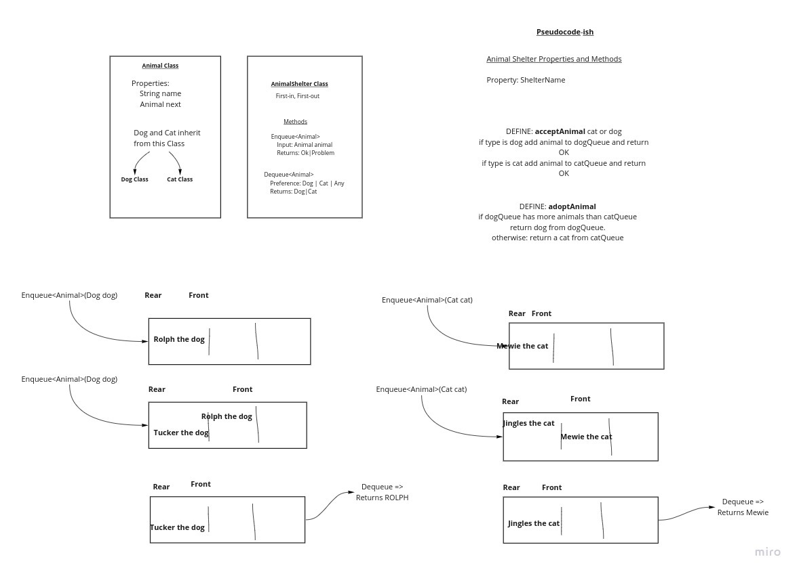

# Challenge Summary
WE are creating a animal shelter class that will adopt and take in cats and dogs.

Every animal shelter has two queues one for cats and one for dogs.

## WhiteBoard Process

## Approach and efficiency
We tried to impulate operations of a normal queue class

Function Accept animal is a O(1) operation because there are no loops or recursion.

function adopt animal is O(1) operation because it has no loops or recursion.

## Solution

We emplemented inheretence so we could test to see whether a cat or dog was accepted into the shelter.

